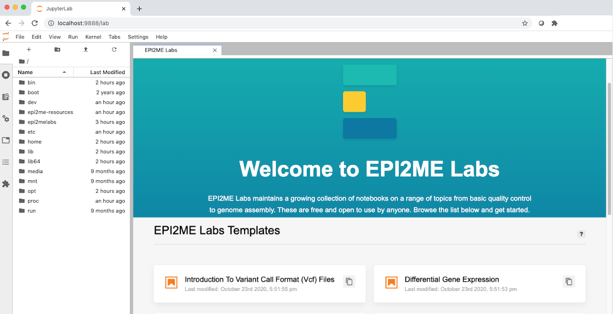

We are pleased to introduce a new release of our EPI2ME Labs.

With this update we are now supporting only the Jupyter interface to EPI2ME
Labs. This Jupyter support has the consequence that users no longer require a
Google account to run or save EPI2ME Labs tutorials and EPI2ME Labs is now
available to users regardless of their geographic location. Additional
information on our reasons for the move to Jupyter are described in a 
separate [post](/jupytermove)

*The EPI2ME Labs landing. This provides a link to the available tutorials and
workflows that are packaged inside the accompanying docker container. As well
as any recent documents of your own*

This release includes a number of extensions to the Jupyter software to support
usability. These extensions include

Inclusion of [autorun code
cells](https://github.com/epi2me-labs/jupyterlab-autorun-cells) that are
automatically computed when a notebook is opened. This functionality allows for
the preparation of forms for data-entry and for the setting of contextual
notebook variables.

The [code cell
collapser](https://github.com/epi2me-labs/jupyterlab-code-cell-collapser)
enables larger blocks of computer code to be hidden (or unhidden) within a
workflow. This makes the more technical notebooks simpler to read by
encouraging focus to results and the written texts.

The [play button](https://github.com/epi2me-labs/jupyterlab-play-cell-button)
extension replicates the functionality of the Google Colaboratory button; a
play icon is placed on the code cell that is to be run. This is simpler than
the default Jupyter play button that may execute code that is elsewhere and
outside of the visible screen.  

We hope that these extensions may also be of use in the preparation of your own
notebooks and workflows. Future EPI2ME Labs releases will continue to further
extend the Jupyter environment to simplify bioinformatics analyses and the
presentation of results.

All of our EPI2ME Labs tutorials have been converted to the Jupyter flavour.
See the [Quick start guide](/quickstart) guide for instructions of installing
and launching the EPI2ME Labs software.

We look forwards to your feedback on this EPI2ME Labs update and we would
welcome any recommendations for workflows that you would like to see in
upcoming releases.
